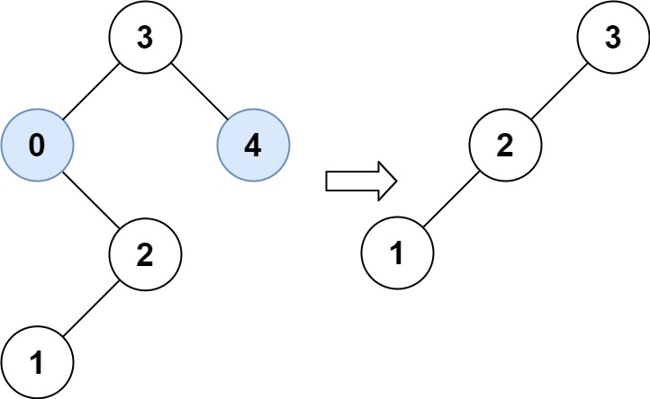
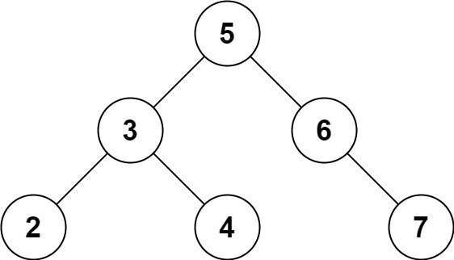

## 相关术语

1. 节点的深度： 从树的根节点到该节点的边的数量；
2. 节点的高度： 从该节点到叶子节点之间最长路径上的边数；
3. 树的高度：  其根节点的高度；
4. 平衡二叉树： 高度差不超过1；

## 遍历

1. 前序、中序、后序遍历中的 前 、 中 、后 指的是根节点的访问时机；

2. 中序遍历常用于获得一个有序的递增序列；

3. 后序遍历可以用于 解析 后缀表示法的数学表达式，但是也可以直接用栈来实现；

   

4. **层序遍历的具体实现 **

   :green_book:

   ```cpp
   	enqueue root
        while(root)
            dequeue node
            access node 
            if node has left node
                enqueue left node
            else if node has right node
                enqueue right node    
   ```

   

## 使用递归解决树相关的问题

### 自顶向下 的解决方案

思路：

自上而下，先访问根节点，做一些计算，然后在调用递归的时候，将计算结果传递给子节点；也就是说数据流是从上到下进行流动的。

```cpp
return if root is null
    if root is leaf node:
			answer = max(answer, depth);
maximum_depth(root.left, depth+1)
maximum_depth(root.right, depth+1)    
```


### 自底向上 的解决方案

思路：

先通过递归方式到达最底层，父节点利用子节点的值来进行运算，然后将计算结果传给祖父节点。也就是说，数据流是从下往上流动的；

```cpp
return  specific value for null node
left_ans = bottom_up(root.left)
right_ans = bottom_up(root.right)
 operate left_ans and right_ans -> answer;
return answer;
```


## 二叉查找树

> **性质**
>
> ​	如果左子树不为空，则 左子树上所有节点的值都要小于根节点的值；
>
> ​	如果右子树不为空，则 右子树上所有节点的值都要大于根节点的值；


> 适用情况
>
> ​	要多次进行搜索、插入、删除 这些操作；


> 时间复杂度
>
> ​	在logN 和 N 之间进行变化，主要是取决于树的高度；

```cpp
//二叉查找树的查找算法
if root is null
    return false;
if target == root.val 
    return success
else if target  < root.val 
    search in left child tree;
else 
    search in right child tree;

//二叉查找树的插入算法
if root is null
    root = new_node;
	return;
else if new_node.value == root.value;
		return ;
else if new_node.value <  root.value
    insert left child tree;
else 
    insert right child tree;
```

>  二叉查找树 删除一个节点的三种情况

1. 被删除节点是叶子节点，直接进行删除
2. 被删除节点只有左子树或者右子树，令其左子树/右子树直接成为父节点的左子树和右子树
3. 被删除节点既有左子树，又有右子树, 则使用左子树的最右节点替代被删节点或者使用右子树的最左节点替代被删节点；


> 常见的高度平衡二叉树
>
> 1. 红黑树
> 2. AVL树
> 3. 伸展树
> 4. 树堆


#### [572. 另一个树的子树](https://leetcode-cn.com/problems/subtree-of-another-tree/)

给定两个非空二叉树 **s** 和 **t**，检验 **s** 中是否包含和 **t** 具有相同结构和节点值的子树。**s** 的一个子树包括 **s** 的一个节点和这个节点的所有子孙。**s** 也可以看做它自身的一棵子树。

**示例 1:**
给定的树 s:

```
     3
    / \
   4   5
  / \
 1   2
```

给定的树 t：

```
   4 
  / \
 1   2
```

返回 **true**，因为 t 与 s 的一个子树拥有相同的结构和节点值。

**示例 2:**
给定的树 s：

```
     3
    / \
   4   5
  / \
 1   2
    /
   0
```

给定的树 t：

```
   4
  / \
 1   2
```

返回 **false**。


起始时间：20:26

截止时间：21:31

思路分析：

​	遍历第一个树上的每个节点，判断节点值是否等于第二个树上的根节点的值，如果相等，遍历第二棵树，确认第二个树上的节点在第一个树上都有对应，如果有，则认为包含了这样一个子树，否则，认为没有包含。

使用递归方法，而不是使用栈的方法；

```cpp
参考别人的方法：
/**
 * Definition for a binary tree node.
 * public class TreeNode {
 *     int val;
 *     TreeNode left;
 *     TreeNode right;
 *     TreeNode(int x) { val = x; }
 * }
 */
class Solution {
    public boolean isSubtree(TreeNode s, TreeNode t) {
       // if (t == null) return true;   // t 为 null 一定都是 true  在题目说t不为空的情况下，这条语句可以注释掉；
        if (s == null) return false;  // 这里 t 一定不为 null, 只要 s 为 null，肯定是 false
        return isSubtree(s.left, t) || isSubtree(s.right, t) || isSameTree(s,t);
    }

    /**
     * 判断两棵树是否相同
     */
    public boolean isSameTree(TreeNode s, TreeNode t){
        if (s == null && t == null) return true;
        if (s == null || t == null) return false;
        if (s.val != t.val) return false;
        return isSameTree(s.left, t.left) && isSameTree(s.right, t.right);
    }
}
```


#### [101. 对称二叉树](https://leetcode-cn.com/problems/symmetric-tree/)

给定一个二叉树，检查它是否是镜像对称的。

例如，二叉树 `[1,2,2,3,4,4,3]` 是对称的。

```
    1
   / \
  2   2
 / \ / \
3  4 4  3
```

 

但是下面这个 `[1,2,2,null,3,null,3]` 则不是镜像对称的:

```
    1
   / \
  2   2
   \   \
   3    3
```

 

**进阶：**

你可以运用递归和迭代两种方法解决这个问题吗？


起始时间：21:33 

截止时间：

目标： 检查是否对称，返回值为bool

条件： 一个二叉树，NULL  or NOT NULL;

方法1： 使用层序遍历，双端队列，所有的空树也都入队； 实现起来需要两个队列，操作起来比较复杂；

方法2：同时使用深度优先进行遍历，不过两个遍历的方向不同，一个是中左右，一个是中右左；

方法3：递归的解决方案（来自题解）更加简单，更加直观；

```cpp
 //个人解法： bug free; 使用的是方法2；
 #include <stack>
class Solution {
public:
    bool isSymmetric(TreeNode* root) {
        if(!root) { return true; }
        if(!root->left && ! root->right) { return true; }
        std::stack<TreeNode*> left_stack;
        std::stack<TreeNode*> right_stack;

        left_stack.push(root);
        right_stack.push(root);
        TreeNode* left_child = nullptr ;
        TreeNode* right_child = nullptr;
        while(!left_stack.empty())
        {
            if(!left_stack.top() && !right_stack.top()) { 
                left_stack.pop();
                right_stack.pop();
                continue; 
            }
            if(!left_stack.top() ||  !right_stack.top()) { return false; }
            if(left_stack.top()->val != right_stack.top()->val) { return false; }

            left_child = left_stack.top()->left;
            right_child = left_stack.top()->right;
            left_stack.pop();
            left_stack.push(left_child);
            left_stack.push(right_child);

            left_child = right_stack.top()->left;
            right_child = right_stack.top()->right;
            right_stack.pop();
            right_stack.push(right_child);         
            right_stack.push(left_child); 
        }
        return true;
    }
};

时间复杂度分析：每个元素都要遍历一遍，所以时间复杂度为O(N)
空间复杂度分析：最大每个栈存储n/2, 两个栈， 所以空间复杂度也是O(N)；
```

```cpp
//按照方法3的实现：
class Solution {
public:
    bool isSymmetric(TreeNode* root) {
        return dfs(root,root); 
    }
private:
    bool dfs(TreeNode* root_left, TreeNode* root_right);
};

//自顶向下的思路；
bool Solution::dfs(TreeNode* root_left, TreeNode* root_right)
{
    if(!root_left && !root_right) { return true; }
    if(!root_left || !root_right) { return false; }
    if(root_left->val != root_right->val) { return false; }

    return dfs(root_left->left, root_right->right) && dfs(root_left->right, root_right->left);
}

```


#### [111. 二叉树的最小深度](https://leetcode-cn.com/problems/minimum-depth-of-binary-tree/)

给定一个二叉树，找出其最小深度。

最小深度是从根节点到最近叶子节点的最短路径上的节点数量。

**说明：**叶子节点是指没有子节点的节点。

 

**示例 1：**


```
输入：root = [3,9,20,null,null,15,7]
输出：2
```

**示例 2：**

```
输入：root = [2,null,3,null,4,null,5,null,6]
输出：5
```

 

**提示：**

- 树中节点数的范围在 `[0, 105]` 内
- `-1000 <= Node.val <= 1000`


起始时间：19:53;

截止时间：20:20；

目标：求解最小深度；

要求：从根节点到叶子节点的值节点数量最小；最小至少为2；

方法1：深度优先，下沉过程中计数，到达叶子节点的时候，更新值，当路径值已经超过最小值的时候，直接pass;

​			1.1 使用递归方案；在全局设置一个最小值；超过最小值直接return, 从上到下的思路；

​			1.2 使用深度优先搜索方案，也是维持一个最小值，搜索过程中，超过最小值的，直接返回；

​			空间复杂度都是O(N), 时间复杂度都是O(N);

​	

```cpp
 //bug free;
class Solution {
public:
    int minDepth(TreeNode* root) {
        if(!root) { return 0; }
        if (!root->left) { return  1+ minDepth(root->right); }
        else if (!root->right) { return  1 + minDepth(root->left); }
        else {  
            int min_left = minDepth(root->left);
            int min_right = minDepth(root->right);
            return min_left  <  min_right ? 1 + min_left : 1 + min_right ;
        }
    }
};
```


#### [404. 左叶子之和](https://leetcode-cn.com/problems/sum-of-left-leaves/)

难度简单326收藏分享切换为英文接收动态反馈

计算给定二叉树的所有左叶子之和。

**示例：**

```
    3
   / \
  9  20
    /  \
   15   7

在这个二叉树中，有两个左叶子，分别是 9 和 15，所以返回 24
```


start_time 20:23;

end_time : 20:51

分析：

目标：左右左叶子节点的和；

条件：二叉树；

方案1： 全局设置一个统计和的值，自上而下方案，


```cpp
//参考代码
class Solution {
public:
    int sumOfLeftLeaves(TreeNode* root) {
        if (root == NULL) return 0;

        int leftValue = sumOfLeftLeaves(root->left);    // 左
        int rightValue = sumOfLeftLeaves(root->right);  // 右
                                                        // 中
        int midValue = 0;
        if (root->left && !root->left->left && !root->left->right) { // 中
            midValue = root->left->val;
        }
        int sum = midValue + leftValue + rightValue;
        return sum;
    }
};

//个人代码
//bug free
class Solution {
public:
    int sumOfLeftLeaves(TreeNode* root) {
        // std::cout << root->val << std::endl;
        if(!root) { return 0; }
        if(!root->left && !root->right) { return 0; }
        else if(!root -> left ) { sumOfLeftLeaves(root->right) ;}
        else 
        {
            if(!root->left->left && !root->left->right) 
            { 
                 sum = sum + root->left->val;
                 sumOfLeftLeaves(root->right) ;
            }
            else
            {
                sumOfLeftLeaves(root->left) ;
                sumOfLeftLeaves(root->right) ;
            } 
        }
        return sum;
    }
private:
    int sum = 0 ;
};
```


#### [687. 最长同值路径](https://leetcode-cn.com/problems/longest-univalue-path/)

难度中等479收藏分享切换为英文接收动态反馈

给定一个二叉树，找到最长的路径，这个路径中的每个节点具有相同值。 这条路径可以经过也可以不经过根节点。

**注意**：两个节点之间的路径长度由它们之间的边数表示。

**示例 1:**

输入:

```
              5
             / \
            4   5
           / \   \
          1   1   5
```

输出:

```
2
```

**示例 2:**

输入:

```
              1
             / \
            4   5
           / \   \
          4   4   5
```

输出:

```
2
```

**注意:** 给定的二叉树不超过10000个结点。 树的高度不超过1000。

start time 21:21

end time  21:56

target: 路径长度，即边的个数；

要求：路径上所有节点的值相同；


方法1：宏观思维：自顶向下，遍历每个节点，对每个节点，计算左子树 的路径长度， 计算右子树的路径长度，二者相加，即是当前的最大长度，更新最大长度， 返回左路径 or 右路径中的最大值 + 1；

​			时间复杂度分析：O(N*N)

​			空间复杂度O(N)

```cpp
//自己实现的方法：
 //bug free;
class Solution {
public:
    int longestUnivaluePath(TreeNode* root) {
        if(!root) { return 0; };
        cal_length(root) ;
        longestUnivaluePath(root->left);
        longestUnivaluePath(root->right);
        return max_path_lenght;
    }
private:
    int cal_length(TreeNode*root){
        if(!root) { return 0; }
        int left_length = 0;
        int right_length = 0;
        if(root->left &&  root->val == root->left->val)
        {
             left_length = 1 +  cal_length(root->left);
        }
        if(root->right &&  root->val == root->right->val)
        {
             right_length = 1 +  cal_length(root->right);
        }
        if(left_length + right_length > max_path_lenght ) { max_path_lenght = left_length +  right_length;}
        return right_length > left_length ? right_length : left_length; 
    }
    int max_path_lenght = 0;
};

//参考解法
class Solution {
    int res = 0;
    public int longestUnivaluePath(TreeNode root) {
        helper(root);
        return res;
    }
    
    int helper(TreeNode root){
        if(root == null) return 0;
        
        int left = helper(root.left);
        int right = helper(root.right);
        
        left = (root.left != null && root.left.val == root.val) ? left + 1 : 0;
        right = (root.right != null && root.right.val == root.val) ? right + 1 : 0;
        
        res = Math.max(res, left + right);
        return Math.max(left, right);
    }
}

```


#### [337. 打家劫舍 III ](https://leetcode-cn.com/problems/house-robber-iii/)

//TODO(snowden) : 由于暂时没有接触动态规划等内容，所以暂时放置；

难度中等914收藏分享切换为英文接收动态反馈

在上次打劫完一条街道之后和一圈房屋后，小偷又发现了一个新的可行窃的地区。这个地区只有一个入口，我们称之为“根”。 除了“根”之外，每栋房子有且只有一个“父“房子与之相连。一番侦察之后，聪明的小偷意识到“这个地方的所有房屋的排列类似于一棵二叉树”。 如果两个直接相连的房子在同一天晚上被打劫，房屋将自动报警。

计算在不触动警报的情况下，小偷一晚能够盗取的最高金额。

**示例 1:**

```
输入: [3,2,3,null,3,null,1]

     3
    / \
   2   3
    \   \ 
     3   1

输出: 7 
解释: 小偷一晚能够盗取的最高金额 = 3 + 3 + 1 = 7.
```

**示例 2:**

```
输入: [3,4,5,1,3,null,1]

     3
    / \
   4   5
  / \   \ 
 1   3   1

输出: 9
解释: 小偷一晚能够盗取的最高金额 = 4 + 5 = 9.
```


目标：求取遍历节点的和的最大值；

要求：不能访问相连的两个节点；**可以间隔一个节点，也可以间隔两个节点**


#### [671. 二叉树中第二小的节点](https://leetcode-cn.com/problems/second-minimum-node-in-a-binary-tree/)

难度简单152收藏分享切换为英文接收动态反馈

给定一个非空特殊的二叉树，每个节点都是正数，并且每个节点的子节点数量只能为 `2` 或 `0`。如果一个节点有两个子节点的话，那么该节点的值等于两个子节点中较小的一个。

更正式地说，`root.val = min(root.left.val, root.right.val)` 总成立。

给出这样的一个二叉树，你需要输出所有节点中的**第二小的值。**如果第二小的值不存在的话，输出 -1 **。**

 

**示例 1：**


```
输入：root = [2,2,5,null,null,5,7]
输出：5
解释：最小的值是 2 ，第二小的值是 5 。
```

**示例 2：**


```
输入：root = [2,2,2]
输出：-1
解释：最小的值是 2, 但是不存在第二小的值。
```

 

**提示：**

- 树中节点数目在范围 `[1, 25]` 内
- `1 <= Node.val <= 231 - 1`
- 对于树中每个节点 `root.val == min(root.left.val, root.right.val)`

start time : 20:54

end time : 22:10；

target 输出第二小节点的值或者 -1；

条件： 

			1. 非空；
			2. 都是正数；
			3. 要么没有子节点，要么有两个子节点；
			4. 两个子节点时，父节点等于两个子节点中的最小值；
			5. 节点值都一样的时候，返回-1；

解法：

方案1： 直接遍历每个节点，寻找次值； 时间复杂度O(N), 空间复杂度O(N) 复杂度过高，暂不考虑；

方案2：自底向上更加合适，因为最后要从顶上看结果；

​			  从根节点开始，左子节点为空，则返回-1; 如果不为空， 判断左子节点值 和 右子节点的值是否相同，如果相同，则遍历左右子树，否则，将小的记为次小节点，遍历另一个子树；

```cpp
//个人方案2解法：
class Solution {
public:
    int findSecondMinimumValue(TreeNode* root) {
        if(!root) { return -1; }
        if (!root->left) { return -1; }
        if(root->left && root->left->val != root->right->val) {
            if(root->left->val == root->val) { 
                 res = res < 0 ? (root->right->val) : (res < root->right->val ? res : root->right->val);
                findSecondMinimumValue(root->left); 
            }
            else
            {
                 res = res < 0 ? (root->left->val) : (res < root->left->val ? res : root->left->val);
                findSecondMinimumValue(root->right); 
            }
             return res;
        }
        findSecondMinimumValue(root->left);
        findSecondMinimumValue(root->right);
        return res;
    }
private:
    int res { -1 };
};
//参考解法；
public int findSecondMinimumValue(TreeNode root) {
    if (root == null) return -1;
    if (root.left == null && root.right == null) return -1;
    int leftVal = root.left.val;
    int rightVal = root.right.val;
    if (leftVal == root.val) leftVal = findSecondMinimumValue(root.left);
    if (rightVal == root.val) rightVal = findSecondMinimumValue(root.right);
    if (leftVal != -1 && rightVal != -1) return Math.min(leftVal, rightVal);
    if (leftVal != -1) return leftVal;
    return rightVal;
}
```


#### [637. 二叉树的层平均值](https://leetcode-cn.com/problems/average-of-levels-in-binary-tree/)

难度简单271收藏分享切换为英文接收动态反馈

给定一个非空二叉树, 返回一个由每层节点平均值组成的数组。

 

**示例 1：**

```
输入：
    3
   / \
  9  20
    /  \
   15   7
输出：[3, 14.5, 11]
解释：
第 0 层的平均值是 3 ,  第1层是 14.5 , 第2层是 11 。因此返回 [3, 14.5, 11] 。
```

 

**提示：**

- 节点值的范围在32位有符号整数范围内。

start time 22:12;

end time : 22:37；

目标： 返回平局值的vector;

条件：非空二叉树；

方案1： 使用两个栈，交替使用，计算每层的值； 空间复杂度 O(N), 时间复杂度 O(N)

方案2：设计一个二级函数，自顶向下处理，计算自己所在的层，并且把自己的值放到该层累加的值上，并且在该层 个数vector 上加1； 空间复杂度O(N), 时间复杂度 O(N)

方案3：可以在每一轮遍历之前获得队列中的节点数量size，遍历时只遍历 size个节点，即可满足每一轮遍历的是同一层的全部节点。


优先使用方案1， 实现起来更加简单；

```cpp
//按照方案2的实现
vector<double> averageOfLevels(TreeNode* root) {
            vector<double> result;
            std::stack<TreeNode*> stack1;
            std::stack<TreeNode*> stack2;
            double sum1 { 0 };
            double sum2 { 0 };
            double num1 { 0 };
            double num2 { 0 };            
            stack1.push(root);
            while(!stack1.empty() || !stack2.empty())
            {
                if(!stack1.empty())
                {
                    num1 = stack1.size();
                    sum1 = 0;
                    while(!stack1.empty())
                    {
                        sum1 += stack1.top()->val;
                        if(stack1.top()->left) {stack2.push(stack1.top()->left);}
                        if(stack1.top()->right){ stack2.push(stack1.top()->right);}
                        stack1.pop();
                    }
                    result.push_back(sum1 / num1);
                }
                else if(!stack2.empty())
                {
                    num2 = stack2.size();
                    sum2 = 0;
                    while(!stack2.empty())
                    {
                        sum2 += stack2.top()->val;
                        if(stack2.top()->left) { stack1.push(stack2.top()->left);}
                        if(stack2.top()->right)  stack1.push(stack2.top()->right);
                        stack2.pop();
                    }
                    result.push_back(sum2 / num2);
                }
            }
            return result;
    }

//参考方案：按照方案3的实现；
public List<Double> averageOfLevels(TreeNode root) {
    List<Double> ret = new ArrayList<>();
    if (root == null) return ret;
    Queue<TreeNode> queue = new LinkedList<>();
    queue.add(root);
    while (!queue.isEmpty()) {
        int cnt = queue.size();
        double sum = 0;
        for (int i = 0; i < cnt; i++) {
            TreeNode node = queue.poll();
            sum += node.val;
            if (node.left != null) queue.add(node.left);
            if (node.right != null) queue.add(node.right);
        }
        ret.add(sum / cnt);
    }
    return ret;
}
```


#### [513. 找树左下角的值](https://leetcode-cn.com/problems/find-bottom-left-tree-value/)

难度中等187收藏分享切换为英文接收动态反馈

给定一个二叉树的 **根节点** `root`，请找出该二叉树的 **最底层 最左边** 节点的值。

假设二叉树中至少有一个节点。

 

**示例 1:**


```
输入: root = [2,1,3]
输出: 1
```

**示例 2:**


```
输入: [1,2,3,4,null,5,6,null,null,7]
输出: 7
```

 

**提示:**

- 二叉树的节点个数的范围是 `[1,104]`
- `-231 <= Node.val <= 231 - 1` 


start time : 22:49;

end time 

target:  节点的值；

condition: 最底层，最左边，非空；

mothed1: 层序遍历，每层从右到左遍历，最后一个节点值是最左测节点的值；时间复杂度O(N), 空间复杂度O(N);

mothed2: 记录每个节点的位置，包括层数，和相对于根节点的的左右相对位置，总是寻找层数最大的，且最左边的节点；中间使用一个函数进行包裹；时间复杂度O(N), 空间复杂度O(N); 这个解法可以用于树中和位置相关的问题；(这个方法还是存在问题的，不长恒为1，有可能导致左右两个节点同行，但是左右不同，却显式result_deep 和 result_left 都是相等的，甚至左侧节点的result_left的值小于右侧 result_left的值的情况，虽然运行通过，但是是存在问题的，还是要使用层序遍历的方法)

另外，如果需要函数需要改变指针参数的指向，则应该使用引用传递；

```cpp
//自己的解法： 注意传入的指针需要修改其指向的时候，要以引用的方式传入；
class Solution {
public:
    int findBottomLeftValue(TreeNode* root) {
        TreeNode* result_node = root;
        int result_deep = 0;
        int result_left = 0;
        function(root, 0,0,result_node,result_deep,result_left);
        return result_node->val;
    }
    void function(TreeNode* curr_node, int curr_deep, int curr_left, TreeNode* &result_node, int &result_deep, int &result_left)
    {
        if(!curr_node) { return ;}
        if((curr_deep > result_deep) || ((result_deep == curr_deep) && (curr_left >  result_left) ) ) { 
            result_deep = curr_deep;
            result_left = curr_left;
            result_node = curr_node;
            
        }
        cout << "curr node val " << curr_node->val << std::endl;
        function(curr_node->left, curr_deep + 1, curr_left + 1, result_node, result_deep, result_left );
        function(curr_node->right, curr_deep + 1, curr_left - 1,   result_node, result_deep , result_left );
    }
};
```


#### [145. 二叉树的后序遍历](https://leetcode-cn.com/problems/binary-tree-postorder-traversal/)

难度简单629收藏分享切换为英文接收动态反馈

给定一个二叉树，返回它的 *后序* 遍历。

**示例:**

```
输入: [1,null,2,3]  
   1
    \
     2
    /
   3 

输出: [3,2,1]
```

**进阶:** 递归算法很简单，你可以通过迭代算法完成吗？

start time : 21:37

end time :

target : 后续遍历；按照遍历顺序，将元素插入到结果中；

条件： ？

方案1： 

```cpp
 //bug free, quick， not only how ,but also why;
class Solution {
public:
    vector<int> postorderTraversal(TreeNode* root) {
        vector<int> result;
        if(!root) { return result; }
        std::stack<TreeNode*> stack;
        TreeNode* curr_p = root;
        while( !stack.empty() || curr_p )
        {
            if(curr_p)
            {
                while(curr_p)
                {
                    stack.push(curr_p);
                    curr_p = curr_p->left;
                }
                curr_p = stack.top()->right;                
                stack.push(nullptr);
            }
            else
            {
                if(stack.top() == nullptr)
                {
                    stack.pop();
                    result.push_back(stack.top()->val);
                    stack.pop();
                    curr_p = nullptr;
                }
                else
                {
                    curr_p = stack.top()->right;
                    stack.push(nullptr);
                }
            }
        }
        return result;
    }
};
```


#### [144. 二叉树的前序遍历](https://leetcode-cn.com/problems/binary-tree-preorder-traversal/)

难度简单609收藏分享切换为英文接收动态反馈

给你二叉树的根节点 `root` ，返回它节点值的 **前序** 遍历。

 

**示例 1：**


```
输入：root = [1,null,2,3]
输出：[1,2,3]
```

**示例 2：**

```
输入：root = []
输出：[]
```

**示例 3：**

```
输入：root = [1]
输出：[1]
```

**示例 4：**


```
输入：root = [1,2]
输出：[1,2]
```

**示例 5：**


```
输入：root = [1,null,2]
输出：[1,2]
```

 

**提示：**

- 树中节点数目在范围 `[0, 100]` 内
- `-100 <= Node.val <= 100`


start time : 19:17

end time：


目标，按照前序遍历的顺序，把每个节点放入vector中；最后返回；

条件：非递归；

方案1： 使用栈：

```cpp
当前节点分为两种情况，空和非空，
如果当前节点不空，则顺序为 
visit , 
push_back right, 
curr = curr->left;

如果当前节点为空， 则顺序为 
visit top, 
mark left and right,  
pop top, 
push right;
```

```cpp
 //not only how, but also why, bug free;
class Solution {
public:
    vector<int> preorderTraversal(TreeNode* root) {
        vector<int> result;
        pre_order2(root,result);
        return result;
    }

    void pre_order2(TreeNode* root, vector<int>& result){
        std::stack<TreeNode*> stack;
        TreeNode* curr = root;
        TreeNode* temp_p = nullptr;
        while(!stack.empty() || curr)
        {
            if(curr)
            {
                result.push_back(curr->val);
                if(curr->right) { stack.push(curr->right); }
                curr = curr->left;
            }
            else
            {
                result.push_back(stack.top()->val);
                temp_p = stack.top()->right;
                curr = stack.top()->left;
                stack.pop();
                if(temp_p) { stack.push(temp_p); }
            }
        }
    }
};
	
```


###  二叉树的中序遍历


```cpp
class Solution {
public:
    vector<int> inorderTraversal(TreeNode* root) {
        vector<int> result;
        if(nullptr == root) { return result; };
        per_order2(root, result);
        return result;
    }

    void per_order2(TreeNode* root, vector<int>& result)
    {
        TreeNode* curr_p = root;
        std::stack<TreeNode*> stack;
        TreeNode* operate_p = nullptr;
        while(!stack.empty() || curr_p)
        {
            if(curr_p)
            {
                stack.push(curr_p);
                curr_p = curr_p->left;
            }
            else
            {
                result.push_back(stack.top()->val);
                curr_p  = stack.top()->right;
                stack.pop();
            }
        }
    }
};
```


几种遍历方式都可以考虑使用 节点空和非空的二元思路来考虑问题；或者是节点是否满足题目要求来进行操作；

比如下面的修剪二叉搜索树，就可以通过判断这个节点是否在low - high 内来进行判断；

#### [669. 修剪二叉搜索树](https://leetcode-cn.com/problems/trim-a-binary-search-tree/)

难度中等405收藏分享切换为英文接收动态反馈

给你二叉搜索树的根节点 `root` ，同时给定最小边界`low` 和最大边界 `high`。通过修剪二叉搜索树，使得所有节点的值在`[low, high]`中。修剪树不应该改变保留在树中的元素的相对结构（即，如果没有被移除，原有的父代子代关系都应当保留）。 可以证明，存在唯一的答案。

所以结果应当返回修剪好的二叉搜索树的新的根节点。注意，根节点可能会根据给定的边界发生改变。

 

**示例 1：**


```
输入：root = [1,0,2], low = 1, high = 2
输出：[1,null,2]
```

**示例 2：**



```
输入：root = [3,0,4,null,2,null,null,1], low = 1, high = 3
输出：[3,2,null,1]
```

**示例 3：**

```
输入：root = [1], low = 1, high = 2
输出：[1]
```

**示例 4：**

```
输入：root = [1,null,2], low = 1, high = 3
输出：[1,null,2]
```

**示例 5：**

```
输入：root = [1,null,2], low = 2, high = 4
输出：[2]
```

 

**提示：**

- 树中节点数在范围 `[1, 104]` 内
- `0 <= Node.val <= 104`
- 树中每个节点的值都是唯一的
- 题目数据保证输入是一棵有效的二叉搜索树
- `0 <= low <= high <= 104`


目标： 返回修剪好的二叉搜索树；

条件：修剪完毕后的所有节点都在low - high 中；包含便捷；

```cpp
参考解法：迭代；
class Solution {
public:
    TreeNode* trimBST(TreeNode* root, int L, int R) {
        if (!root) return nullptr;

        // 处理头结点，让root移动到[L, R] 范围内，注意是左闭右闭
        while (root != nullptr && (root->val < L || root->val > R)) {
            if (root->val < L) root = root->right; // 小于L往右走
            else root = root->left; // 大于R往左走
        }
        TreeNode *cur = root;
        // 此时root已经在[L, R] 范围内，处理左孩子元素小于L的情况
        while (cur != nullptr) {
            while (cur->left && cur->left->val < L) {
                cur->left = cur->left->right;
            }
            cur = cur->left;
        }
        cur = root;

        // 此时root已经在[L, R] 范围内，处理右孩子大于R的情况
        while (cur != nullptr) {
            while (cur->right && cur->right->val > R) {
                cur->right = cur->right->left;
            }
            cur = cur->right;
        }
        return root;
    }
};

//参考解法： 递归

class Solution {
public:
    TreeNode* trimBST(TreeNode* root, int low, int high) {
        if (root == nullptr) return nullptr;
        if (root->val < low) return trimBST(root->right, low, high); 
        if (root->val > high) return trimBST(root->left, low, high); 
        root->left = trimBST(root->left, low, high);
        root->right = trimBST(root->right, low, high);
        return root;
    }
};


```


#### [230. 二叉搜索树中第K小的元素](https://leetcode-cn.com/problems/kth-smallest-element-in-a-bst/)

难度中等418收藏分享切换为英文接收动态反馈

给定一个二叉搜索树的根节点 `root` ，和一个整数 `k` ，请你设计一个算法查找其中第 `k` 个最小元素（从 1 开始计数）。

 

**示例 1：**


```
输入：root = [3,1,4,null,2], k = 1
输出：1
```

**示例 2：**


```
输入：root = [5,3,6,2,4,null,null,1], k = 3
输出：3
```

 

 

**提示：**

- 树中的节点数为 `n` 。
- `1 <= k <= n <= 104`
- `0 <= Node.val <= 104`

 

**进阶：**如果二叉搜索树经常被修改（插入/删除操作）并且你需要频繁地查找第 `k` 小的值，你将如何优化算法？


target: 输出第K小的元素；

条件： BST； n 小于节点数；

make sense, bugfree;

```cpp
 //bugfree;
//递归解法；
class Solution {
public:
    int kthSmallest(TreeNode* root, int k) {
        int counter = 0;
        int result = 0;
        midSearch(root, k, counter, result);
        return result;
    }
    int midSearch(TreeNode* root ,int k , int& counter, int& result)
    {
        if(nullptr == root) { return -1; }
        midSearch(root->left, k, counter, result);
        if(++counter == k) { result = root->val; return -1; }
        midSearch(root->right, k, counter, result);
        return -1;
    }
};

//迭代解法；
class Solution {
public:
    int kthSmallest(TreeNode* root, int k) {
        TreeNode* curr_p = root;
        TreeNode* operate_p = nullptr;
        std::stack<TreeNode*> stack;
        while(!stack.empty() || curr_p)
        {
            if(curr_p)
            {
                while(curr_p)
                {
                    stack.push(curr_p);
                    curr_p = curr_p->left;
                }
            }
            else
            {
                curr_p = stack.top()->right;
                k--;
                if(0 == k) { return stack.top()->val;}
                stack.pop();
            }
        }
        return 0;
    }
};
```


感悟： 对于二叉搜索树，第K小，这种，需要使用遍历算法；


#### [538. 把二叉搜索树转换为累加树](https://leetcode-cn.com/problems/convert-bst-to-greater-tree/)

难度中等555收藏分享切换为英文接收动态反馈

给出二叉 **搜索** 树的根节点，该树的节点值各不相同，请你将其转换为累加树（Greater Sum Tree），使每个节点 `node` 的新值等于原树中大于或等于 `node.val` 的值之和。

提醒一下，二叉搜索树满足下列约束条件：

- 节点的左子树仅包含键 **小于** 节点键的节点。
- 节点的右子树仅包含键 **大于** 节点键的节点。
- 左右子树也必须是二叉搜索树。

**注意：**本题和 1038: https://leetcode-cn.com/problems/binary-search-tree-to-greater-sum-tree/ 相同

 

**示例 1：**

****

```
输入：[4,1,6,0,2,5,7,null,null,null,3,null,null,null,8]
输出：[30,36,21,36,35,26,15,null,null,null,33,null,null,null,8]
```

**示例 2：**

```
输入：root = [0,null,1]
输出：[1,null,1]
```

**示例 3：**

```
输入：root = [1,0,2]
输出：[3,3,2]
```

**示例 4：**

```
输入：root = [3,2,4,1]
输出：[7,9,4,10]
```

 

**提示：**

- 树中的节点数介于 `0` 和 `104` 之间。
- 每个节点的值介于 `-104` 和 `104` 之间。
- 树中的所有值 **互不相同** 。
- 给定的树为二叉搜索树。


target: bugfree; 返回一棵树的根节点；

条件： 累加树， 各个节点值各不相同；二叉搜索树；


方案1： 使用中序遍历，但是是从右到左进行遍历；原因：右边都是大于左边的，按照这个顺序，把之前的累加值都添加到当前节点，并且进行返回；

方案2： 递归；先遍历右边，再遍历左边；遍历完成右边以后，把右边的和值加到本节点，然后拿这个值交给左节点进行累加；最后返回左边遍历的值；


```cpp
class Solution {
public:
    TreeNode* convertBST(TreeNode* root) {
        int sum = 0;
        midorder(root, sum);
        return root;
    }
    TreeNode* midorder(TreeNode* root, int& sum)
    {
        if(nullptr == root) { return nullptr; }
        midorder(root->right, sum);
        root->val = root->val + sum;
        sum = root->val;
        midorder(root->left, sum);
        return nullptr;
    }
};

class Solution {
public:
    TreeNode* convertBST(TreeNode* root) {
        int sum = 0;
        TreeNode* curr_p = root;
        std::stack<TreeNode*> stack;
        while(!stack.empty() || curr_p)
        {
            if(curr_p)
            {
                while(curr_p)
                {
                    stack.push(curr_p);
                    curr_p = curr_p->right;
                }
            }
            else
            {
                sum = sum + stack.top()->val;
                stack.top()->val = sum;
                curr_p = stack.top()->left;
                stack.pop();
            }
        }
        
        return root;
    }
};
```


#### [235. 二叉搜索树的最近公共祖先](https://leetcode-cn.com/problems/lowest-common-ancestor-of-a-binary-search-tree/)

难度简单622收藏分享切换为英文接收动态反馈

给定一个二叉搜索树, 找到该树中两个指定节点的最近公共祖先。

[百度百科](https://baike.baidu.com/item/最近公共祖先/8918834?fr=aladdin)中最近公共祖先的定义为：“对于有根树 T 的两个结点 p、q，最近公共祖先表示为一个结点 x，满足 x 是 p、q 的祖先且 x 的深度尽可能大（**一个节点也可以是它自己的祖先**）。”

例如，给定如下二叉搜索树: root = [6,2,8,0,4,7,9,null,null,3,5]


 

**示例 1:**

```
输入: root = [6,2,8,0,4,7,9,null,null,3,5], p = 2, q = 8
输出: 6 
解释: 节点 2 和节点 8 的最近公共祖先是 6。
```

**示例 2:**

```
输入: root = [6,2,8,0,4,7,9,null,null,3,5], p = 2, q = 4
输出: 2
解释: 节点 2 和节点 4 的最近公共祖先是 2, 因为根据定义最近公共祖先节点可以为节点本身。
```

 

**说明:**

- 所有节点的值都是唯一的。
- p、q 为不同节点且均存在于给定的二叉搜索树中。

target: 返回目标节点的指针；

条件，两个节点的公共祖先；


方案2： 使用迭代方案：从根节点开始，如果都大于，则向右边节点搜索，如果都小于，则向左边节点进行搜索，如果不满足，则直接退出；

```cpp
class Solution {
public:
    TreeNode* lowestCommonAncestor(TreeNode* root, TreeNode* p, TreeNode* q) {
        if ((root == p) || (root == q)) { return root; }
        TreeNode* curr_p = root;
        while((curr_p) && ((p->val > curr_p->val && q->val > curr_p->val) || (p->val < curr_p->val && q->val < curr_p->val)))
        {
            if(p->val > curr_p->val && q->val > curr_p->val)
            {
                curr_p = curr_p->right;
            }
            else
            {
                curr_p = curr_p->left;
            }
        }
        return curr_p;
    }
};
```

**感想：上面这个是对某个节点按照要求向左或者向右运动的模板，应该记住**

参考解答：

```
我们从根节点开始遍历；

如果当前节点的值大于 pp 和 qq 的值，说明 pp 和 qq 应该在当前节点的左子树，因此将当前节点移动到它的左子节点；

如果当前节点的值小于 pp 和 qq 的值，说明 pp 和 qq 应该在当前节点的右子树，因此将当前节点移动到它的右子节点；

如果当前节点的值不满足上述两条要求，那么说明当前节点就是「分岔点」。此时，pp 和 qq 要么在当前节点的不同的子树中，要么其中一个就是当前节点。

```


#### [236. 二叉树的最近公共祖先](https://leetcode-cn.com/problems/lowest-common-ancestor-of-a-binary-tree/)

难度中等1214收藏分享切换为英文接收动态反馈

给定一个二叉树, 找到该树中两个指定节点的最近公共祖先。

[百度百科](https://baike.baidu.com/item/最近公共祖先/8918834?fr=aladdin)中最近公共祖先的定义为：“对于有根树 T 的两个节点 p、q，最近公共祖先表示为一个节点 x，满足 x 是 p、q 的祖先且 x 的深度尽可能大（**一个节点也可以是它自己的祖先**）。”

 

**示例 1：**


```
输入：root = [3,5,1,6,2,0,8,null,null,7,4], p = 5, q = 1
输出：3
解释：节点 5 和节点 1 的最近公共祖先是节点 3 。
```

**示例 2：**


```
输入：root = [3,5,1,6,2,0,8,null,null,7,4], p = 5, q = 4
输出：5
解释：节点 5 和节点 4 的最近公共祖先是节点 5 。因为根据定义最近公共祖先节点可以为节点本身。
```

**示例 3：**

```
输入：root = [1,2], p = 1, q = 2
输出：1
```

 

**提示：**

- 树中节点数目在范围 `[2, 105]` 内。
- `-109 <= Node.val <= 109`
- 所有 `Node.val` `互不相同` 。
- `p != q`
- `p` 和 `q` 均存在于给定的二叉树中。


方案1：递归法： 自底向上的思路；对于每次返回来的值，都查看是否标记为找到了p,或者q, 返回1，找到了p, 返回2 ，找到了q, 返回3 全部找到了，返回0 ，都没找到；如果当前指针等于 p, 返回1， 如果当前指等于q， 则返回3；

方案2：使用后序遍历，一旦发现两个都找到了，如果不是左右节点，就返回栈顶元素，否则就返回最后访问节点的元素；


```cpp
方案1：递归；
class Solution {
public:
    TreeNode* lowestCommonAncestor(TreeNode* root, TreeNode* p, TreeNode* q) {
        if(nullptr == root) { return nullptr;}
        TreeNode* result = nullptr;
        search_two_child(root, p, q, result);
        return result;
    }
    int search_two_child(TreeNode* root, TreeNode* p, TreeNode* q, TreeNode*& result)
    {
        if(nullptr == root) { return 0; }
        int left = search_two_child(root->left, p, q, result);
        if(left == 3) { return 3;}
        int right = search_two_child(root->right, p, q, result);
        if(right == 3 ) { return 3; }
        int mid = 0;
        if(root == p) { mid = 1; }
        if(root == q) { mid = 2; }
        if(left + mid + right == 3) {result = root;}
        return left + mid + right;
    }
};

方案2：迭代版本；
```


#### [108. 将有序数组转换为二叉搜索树](https://leetcode-cn.com/problems/convert-sorted-array-to-binary-search-tree/)

难度简单801收藏分享切换为英文接收动态反馈

给你一个整数数组 `nums` ，其中元素已经按 **升序** 排列，请你将其转换为一棵 **高度平衡** 二叉搜索树。

**高度平衡** 二叉树是一棵满足「每个节点的左右两个子树的高度差的绝对值不超过 1 」的二叉树。

 

**示例 1：**


```
输入：nums = [-10,-3,0,5,9]
输出：[0,-3,9,-10,null,5]
解释：[0,-10,5,null,-3,null,9] 也将被视为正确答案：
```

**示例 2：**


```
输入：nums = [1,3]
输出：[3,1]
解释：[1,3] 和 [3,1] 都是高度平衡二叉搜索树。
```

 

**提示：**

- `1 <= nums.length <= 104`
- `-104 <= nums[i] <= 104`
- `nums` 按 **严格递增** 顺序排列


方案1：递归，从中间划开一刀，左边进行，右边进行；新建节点为当前值，

```cpp
个人解法：
class Solution {
public:
    TreeNode* sortedArrayToBST(vector<int>& nums) {
        if(nums.size() == 0) { return nullptr; }
        if(nums.size() == 1) { return (new TreeNode(nums[0])); }
        vector<int> nums_left(nums.begin(), nums.begin() + nums.size() / 2);
        vector<int> nums_right(nums.begin() + nums.size() /2 + 1 , nums.begin() +nums.size());
        TreeNode* left = sortedArrayToBST(nums_left);
        TreeNode* right = sortedArrayToBST(nums_right);
        
        TreeNode* root = new TreeNode(nums[nums.size()/2]);
        root->left = left;
        root->right = right;
        return root;
    }
};

参考解法：
    class Solution {
    public TreeNode sortedArrayToBST(int[] nums) {
        return dfs(nums, 0, nums.length - 1);
    }

    private TreeNode dfs(int[] nums, int lo, int hi) {
        if (lo > hi) {
            return null;
        } 
        // 以升序数组的中间元素作为根节点 root。
        int mid = lo + (hi - lo) / 2;
        TreeNode root = new TreeNode(nums[mid]);
        // 递归的构建 root 的左子树与右子树。
        root.left = dfs(nums, lo, mid - 1);
        root.right = dfs(nums, mid + 1, hi); 
        return root;
    }
}

```


#### [109. 有序链表转换二叉搜索树](https://leetcode-cn.com/problems/convert-sorted-list-to-binary-search-tree/)

难度中等557收藏分享切换为英文接收动态反馈

给定一个单链表，其中的元素按升序排序，将其转换为高度平衡的二叉搜索树。

本题中，一个高度平衡二叉树是指一个二叉树*每个节点* 的左右两个子树的高度差的绝对值不超过 1。

**示例:**

```
给定的有序链表： [-10, -3, 0, 5, 9],

一个可能的答案是：[0, -3, 9, -10, null, 5], 它可以表示下面这个高度平衡二叉搜索树：

      0
     / \
   -3   9
   /   /
 -10  5
```


目标：返回平衡二叉树的根节点；

条件：给定单链表，按照升序；二叉搜索树；

```cpp
参考：
class Solution {
public:
    ListNode* getMedian(ListNode* left, ListNode* right) {
        ListNode* fast = left;
        ListNode* slow = left;
        while (fast != right && fast->next != right) {
            fast = fast->next;
            fast = fast->next;
            slow = slow->next;
        }
        return slow;
    }

    TreeNode* buildTree(ListNode* left, ListNode* right) {
        if (left == right) {
            return nullptr;
        }
        ListNode* mid = getMedian(left, right);
        TreeNode* root = new TreeNode(mid->val);
        root->left = buildTree(left, mid);
        root->right = buildTree(mid->next, right);
        return root;
    }

    TreeNode* sortedListToBST(ListNode* head) {
        return buildTree(head, nullptr);
    }
};
时间复杂度：O(n \log n)O(nlogn)，其中 nn 是链表的长度。

设长度为 nn 的链表构造二叉搜索树的时间为 T(n)T(n)，递推式为 T(n) = 2 \cdot T(n/2) + O(n)T(n)=2⋅T(n/2)+O(n)，根据主定理，T(n) = O(n \log n)T(n)=O(nlogn)。

空间复杂度：O(\log n)O(logn)，这里只计算除了返回答案之外的空间。平衡二叉树的高度为 O(\log n)O(logn)，即为递归过程中栈的最大深度，也就是需要的空间。


参考解法2：
    class Solution {
public:
    int getLength(ListNode* head) {
        int ret = 0;
        for (; head != nullptr; ++ret, head = head->next);
        return ret;
    }

    TreeNode* buildTree(ListNode*& head, int left, int right) {
        if (left > right) {
            return nullptr;
        }
        int mid = (left + right + 1) / 2;
        TreeNode* root = new TreeNode();
        root->left = buildTree(head, left, mid - 1);
        root->val = head->val;
        head = head->next;
        root->right = buildTree(head, mid + 1, right);
        return root;
    }

    TreeNode* sortedListToBST(ListNode* head) {
        int length = getLength(head);
        return buildTree(head, 0, length - 1);
    }
};
时间复杂度：O(n)O(n)，其中 nn 是链表的长度。

设长度为 nn 的链表构造二叉搜索树的时间为 T(n)T(n)，递推式为 T(n) = 2 \cdot T(n/2) + O(1)T(n)=2⋅T(n/2)+O(1)，根据主定理，T(n) = O(n)T(n)=O(n)。

空间复杂度：O(\log n)O(logn)，这里只计算除了返回答案之外的空间。平衡二叉树的高度为 O(\log n)O(logn)，即为递归过程中栈的最大深度，也就是需要的空间。

参考解法3：
    public TreeNode sortedListToBST(ListNode head) {
    if (head == null) return null;
    if (head.next == null) return new TreeNode(head.val);
    ListNode preMid = preMid(head);
    ListNode mid = preMid.next;
    preMid.next = null;  // 断开链表
    TreeNode t = new TreeNode(mid.val);
    t.left = sortedListToBST(head);
    t.right = sortedListToBST(mid.next);
    return t;
}

private ListNode preMid(ListNode head) {
    ListNode slow = head, fast = head.next;
    ListNode pre = head;
    while (fast != null && fast.next != null) {
        pre = slow;
        slow = slow.next;
        fast = fast.next.next;
    }
    return pre;
}

作者：LeetCode-Solution
链接：https://leetcode-cn.com/problems/convert-sorted-list-to-binary-search-tree/solution/you-xu-lian-biao-zhuan-huan-er-cha-sou-suo-shu-1-3/
来源：力扣（LeetCode）
著作权归作者所有。商业转载请联系作者获得授权，非商业转载请注明出处。
```


#### [653. 两数之和 IV - 输入 BST](https://leetcode-cn.com/problems/two-sum-iv-input-is-a-bst/)

难度简单256收藏分享切换为英文接收动态反馈

给定一个二叉搜索树 `root` 和一个目标结果 `k`，如果 BST 中存在两个元素且它们的和等于给定的目标结果，则返回 `true`。

 

**示例 1：**


```
输入: root = [5,3,6,2,4,null,7], k = 9
输出: true
```

**示例 2：**



```
输入: root = [5,3,6,2,4,null,7], k = 28
输出: false
```

**示例 3：**

```
输入: root = [2,1,3], k = 4
输出: true
```

**示例 4：**

```
输入: root = [2,1,3], k = 1
输出: false
```

**示例 5：**

```
输入: root = [2,1,3], k = 3
输出: true
```

 

**提示:**

- 二叉树的节点个数的范围是 `[1, 104]`.
- `-104 <= Node.val <= 104`
- `root` 为二叉搜索树
- `-105 <= k <= 105`


思路： 

方案1： 递归方案： 使用先序遍历，对于每个节点，计算k和当前节点的差值，然后从根节点开始查找是否存在这个数值；如果存在，则返回true,否则返回false;

```cpp
个人代码：
class Solution {
public:
    bool findTarget(TreeNode* root, int k) {
        return first_order(root, root, k);
    }
    bool first_order(TreeNode* curr,  TreeNode* root, int k)
    {
        if(!curr) { return false; }
        int diff = k - curr->val;
        if((search_value(root,diff)) && (diff != curr->val) ) { return true; }
        return first_order(curr->left, root, k) || first_order(curr->right, root, k);
    }
    bool search_value(TreeNode* root, int value)
    {
        while(root && root->val != value  )
        {
            if(value > root->val) { root = root->right;}
            else { root = root->left; }
        }
        if(!root ) { return false; }
        else {  return true;  }
    }
};
```


​		


#### [530. 二叉搜索树的最小绝对差](https://leetcode-cn.com/problems/minimum-absolute-difference-in-bst/)

难度简单262收藏分享切换为英文接收动态反馈

给你一棵所有节点为非负值的二叉搜索树，请你计算树中任意两节点的差的绝对值的最小值。

 

**示例：**

```
输入：

   1
    \
     3
    /
   2

输出：
1

解释：
最小绝对差为 1，其中 2 和 1 的差的绝对值为 1（或者 2 和 3）。
```

 

**提示：**

- 树中至少有 2 个节点。
- 本题与 783 https://leetcode-cn.com/problems/minimum-distance-between-bst-nodes/ 相同

方案1： 使用中序遍历，计算当前节点和上一个节点之间的差值，用这个差值在条件下更新 min值；递归或者栈都可以，栈可能会更加清晰；但是递归代码相对比较简单；

方案2：展开到一个vector上，再进行对比，但是这种方法多了一步操作，但是容易理解；

```cpp
//个人解法
class Solution {
public:
    int getMinimumDifference(TreeNode* root) {
        int last_value = -1;
        int min = -1;
        mid_search_min(root, last_value, min);
        return min;
    }
    void mid_search_min(TreeNode* curr_p, int& last_value, int& min)
    {
        if(!curr_p) { return; }
        mid_search_min(curr_p->left, last_value, min);
        if(last_value == -1)
        {
            
        }
        else if(min == -1)
        {
            min = curr_p->val - last_value;
        } 
        else if(curr_p->val - last_value < min)
        {
            min = curr_p->val - last_value;
        }
        last_value = curr_p->val;
        mid_search_min(curr_p->right, last_value, min);
    }
};

//参考：
private int minDiff = Integer.MAX_VALUE;
private TreeNode preNode = null;

public int getMinimumDifference(TreeNode root) {
    inOrder(root);
    return minDiff;
}

private void inOrder(TreeNode node) {
    if (node == null) return;
    inOrder(node.left);
    if (preNode != null) minDiff = Math.min(minDiff, node.val - preNode.val);
    preNode = node;
    inOrder(node.right);
}
```


#### [501. 二叉搜索树中的众数](https://leetcode-cn.com/problems/find-mode-in-binary-search-tree/)

难度简单327收藏分享切换为英文接收动态反馈

给定一个有相同值的二叉搜索树（BST），找出 BST 中的所有众数（出现频率最高的元素）。

假定 BST 有如下定义：

- 结点左子树中所含结点的值小于等于当前结点的值
- 结点右子树中所含结点的值大于等于当前结点的值
- 左子树和右子树都是二叉搜索树

例如：
给定 BST `[1,null,2,2]`,

```
   1
    \
     2
    /
   2
```

`返回[2]`.

**提示**：如果众数超过1个，不需考虑输出顺序

**进阶：**你可以不使用额外的空间吗？（假设由递归产生的隐式调用栈的开销不被计算在内）

方案1： 使用递归顺序 使用中序遍历，统计连续相同节点的个数，并且和最大值进行比较，如果大于最大值，就更新（vector清空，重新加入最大的值）；等于就入vector;

方案2：平摊到数组上，但是增加了一次时间成本；

```cpp
个人解法： 方案1；
class Solution {
public:
    vector<int> findMode(TreeNode* root) {
        vector<int> result; 
        int counter = 0;
        int max_counter = 0;
        TreeNode* last_node = nullptr ;
        searchMode(root, last_node, counter, max_counter, result);
        return result;
    }
    void searchMode(TreeNode* root, TreeNode*& last_node, int& counter, int& max_counter , vector<int>& result)
    {
        if(nullptr ==  root) { return; }
        searchMode(root->left, last_node, counter, max_counter, result);
        if( last_node && (last_node->val == root->val) ) { counter++; }
        else if( last_node && (last_node->val != root->val)) { counter = 0; }
        last_node = root;
        if(counter > max_counter) {  max_counter = counter ; result.clear(); result.push_back(root->val);}
        else if( counter == max_counter) { result.push_back(root->val); }

        searchMode(root->right, last_node, counter, max_counter,  result);
    }
};
```


#### [208. 实现 Trie (前缀树)](https://leetcode-cn.com/problems/implement-trie-prefix-tree/)

难度中等826收藏分享切换为英文接收动态反馈

**[Trie](https://baike.baidu.com/item/字典树/9825209?fr=aladdin)**（发音类似 "try"）或者说 **前缀树** 是一种树形数据结构，用于高效地存储和检索字符串数据集中的键。这一数据结构有相当多的应用情景，例如自动补完和拼写检查。

请你实现 Trie 类：

- `Trie()` 初始化前缀树对象。
- `void insert(String word)` 向前缀树中插入字符串 `word` 。
- `boolean search(String word)` 如果字符串 `word` 在前缀树中，返回 `true`（即，在检索之前已经插入）；否则，返回 `false` 。
- `boolean startsWith(String prefix)` 如果之前已经插入的字符串 `word` 的前缀之一为 `prefix` ，返回 `true` ；否则，返回 `false` 。

 

**示例：**

```
输入
["Trie", "insert", "search", "search", "startsWith", "insert", "search"]
[[], ["apple"], ["apple"], ["app"], ["app"], ["app"], ["app"]]
输出
[null, null, true, false, true, null, true]

解释
Trie trie = new Trie();
trie.insert("apple");
trie.search("apple");   // 返回 True
trie.search("app");     // 返回 False
trie.startsWith("app"); // 返回 True
trie.insert("app");
trie.search("app");     // 返回 True
```

 

**提示：**

- `1 <= word.length, prefix.length <= 2000`
- `word` 和 `prefix` 仅由小写英文字母组成
- `insert`、`search` 和 `startsWith` 调用次数 **总计** 不超过 `3 * 104` 次

```
知识补充：
介绍 Trie🌳
Trie 是一颗非典型的多叉树模型，多叉好理解，即每个结点的分支数量可能为多个。

为什么说非典型呢？因为它和一般的多叉树不一样，尤其在结点的数据结构设计上，比如一般的多叉树的结点是这样的：

C++

struct TreeNode {
    VALUETYPE value;    //结点值
    TreeNode* children[NUM];    //指向孩子结点
};
而 Trie 的结点是这样的(假设只包含'a'~'z'中的字符)：

C++

struct TrieNode {
    bool isEnd; //该结点是否是一个串的结束
    TrieNode* next[26]; //字母映射表
};
要想学会 Trie 就得先明白它的结点设计。我们可以看到TrieNode结点中并没有直接保存字符值的数据成员，那它是怎么保存字符的呢？

这时字母映射表next 的妙用就体现了，TrieNode* next[26]中保存了对当前结点而言下一个可能出现的所有字符的链接，因此我们可以通过一个父结点来预知它所有子结点的值：

C++

for (int i = 0; i < 26; i++) {
    char ch = 'a' + i;
    if (parentNode->next[i] == NULL) {
        说明父结点的后一个字母不可为 ch
    } else {
        说明父结点的后一个字母可以是 ch
    }
}
我们来看个例子吧。

想象以下，包含三个单词 "sea","sells","she" 的 Trie 会长啥样呢？

它的真实情况是这样的：


Trie 中一般都含有大量的空链接，因此在绘制一棵单词查找树时一般会忽略空链接，同时为了方便理解我们可以画成这样：


接下来我们一起来实现对 Trie 的一些常用操作方法。

定义类 Trie
C++

class Trie {
private:
    bool isEnd;
    Trie* next[26];
public:
    //方法将在下文实现...
};
插入
描述：向 Trie 中插入一个单词 word

实现：这个操作和构建链表很像。首先从根结点的子结点开始与 word 第一个字符进行匹配，一直匹配到前缀链上没有对应的字符，这时开始不断开辟新的结点，直到插入完 word 的最后一个字符，同时还要将最后一个结点isEnd = true;，表示它是一个单词的末尾。

C++

void insert(string word) {
    Trie* node = this;
    for (char c : word) {
        if (node->next[c-'a'] == NULL) {
            node->next[c-'a'] = new Trie();
        }
        node = node->next[c-'a'];
    }
    node->isEnd = true;
}
查找
描述：查找 Trie 中是否存在单词 word

实现：从根结点的子结点开始，一直向下匹配即可，如果出现结点值为空就返回 false，如果匹配到了最后一个字符，那我们只需判断 node->isEnd即可。

C++

bool search(string word) {
    Trie* node = this;
    for (char c : word) {
        node = node->next[c - 'a'];
        if (node == NULL) {
            return false;
        }
    }
    return node->isEnd;
}
前缀匹配
描述：判断 Trie 中是或有以 prefix 为前缀的单词

实现：和 search 操作类似，只是不需要判断最后一个字符结点的isEnd，因为既然能匹配到最后一个字符，那后面一定有单词是以它为前缀的。

C++

bool startsWith(string prefix) {
    Trie* node = this;
    for (char c : prefix) {
        node = node->next[c-'a'];
        if (node == NULL) {
            return false;
        }
    }
    return true;
}
到这我们就已经实现了对 Trie 的一些基本操作，这样我们对 Trie 就有了进一步的理解。完整代码我贴在了文末。

总结
通过以上介绍和代码实现我们可以总结出 Trie 的几点性质：

Trie 的形状和单词的插入或删除顺序无关，也就是说对于任意给定的一组单词，Trie 的形状都是唯一的。

查找或插入一个长度为 L 的单词，访问 next 数组的次数最多为 L+1，和 Trie 中包含多少个单词无关。

Trie 的每个结点中都保留着一个字母表，这是很耗费空间的。如果 Trie 的高度为 n，字母表的大小为 m，最坏的情况是 Trie 中还不存在前缀相同的单词，那空间复杂度就为 O(m^n)O(m 
n
 )。

最后，关于 Trie 的应用场景，希望你能记住 8 个字：一次建树，多次查询。(慢慢领悟叭~~)


```


```
class Trie {
private:
    bool isEnd;
    Trie* next[26];
public:
    Trie() {
        isEnd = false;
        memset(next, 0, sizeof(next));
    }
    
    void insert(string word) {
        Trie* node = this;
        for (char c : word) {
            if (node->next[c-'a'] == NULL) {
                node->next[c-'a'] = new Trie();
            }
            node = node->next[c-'a'];
        }
        node->isEnd = true;
    }
    
    bool search(string word) {
        Trie* node = this;
        for (char c : word) {
            node = node->next[c - 'a'];
            if (node == NULL) {
                return false;
            }
        }
        return node->isEnd;
    }
    
    bool startsWith(string prefix) {
        Trie* node = this;
        for (char c : prefix) {
            node = node->next[c-'a'];
            if (node == NULL) {
                return false;
            }
        }
        return true;
    }
};

```

1. 其实不是很需要单独为结点定义一个结构体，将类的实例本身视作一个结点就好。**这么做的好处是不必在构造函数中new结点。** ？？？
2. 可以直接用ascii码进行运算后进行索引，这样可读性更好，也不用再显式强制类型转换和查ascii码表。

#### [677. 键值映射](https://leetcode-cn.com/problems/map-sum-pairs/)

难度中等92收藏分享切换为英文接收动态反馈

实现一个 `MapSum` 类，支持两个方法，`insert` 和 `sum`：

- `MapSum()` 初始化 `MapSum` 对象
- `void insert(String key, int val)` 插入 `key-val` 键值对，字符串表示键 `key` ，整数表示值 `val` 。如果键 `key` 已经存在，那么原来的键值对将被替代成新的键值对。
- `int sum(string prefix)` 返回所有以该前缀 `prefix` 开头的键 `key` 的值的总和。

 

**示例：**

```
输入：
["MapSum", "insert", "sum", "insert", "sum"]
[[], ["apple", 3], ["ap"], ["app", 2], ["ap"]]
输出：
[null, null, 3, null, 5]

解释：
MapSum mapSum = new MapSum();
mapSum.insert("apple", 3);  
mapSum.sum("ap");           // return 3 (apple = 3)
mapSum.insert("app", 2);    
mapSum.sum("ap");           // return 5 (apple + app = 3 + 2 = 5)
```

 

**提示：**

- `1 <= key.length, prefix.length <= 50`
- `key` 和 `prefix` 仅由小写英文字母组成
- `1 <= val <= 1000`
- 最多调用 `50` 次 `insert` 和 `sum`


输出目标：实现两个函数；

条件：若有键相同，则直接替换值；

​			返回所有有指定前缀的 键 对应值的和；

思路：把键构建成一棵前缀树，并且在前缀树上存放值和是否是终端节点；

```cpp
class MapSum {
public:
    /** Initialize your data structure here. */
    MapSum() {

    }
    
    void insert(string key, int val) {
        MapSum* curr_p = this;
        for(auto c : key)
        {
            if(curr_p->next[c - 'a'] == nullptr)
            {
                curr_p->next[c - 'a'] = new MapSum();
            }
            curr_p = curr_p->next[c - 'a'];
        }
        curr_p->is_end = true;
        curr_p->value = val;
    }
    
    int sum(string prefix) {
        MapSum* curr_p = this;
        for(auto c : prefix)
        {
            if(curr_p->next[c - 'a'] == nullptr)
            {
                return 0;
            }
            curr_p = curr_p->next[c - 'a'];
        }
        int mysum = 0;
        calcul_all_next_sum(curr_p, mysum);
        return mysum;
    }
    void calcul_all_next_sum(MapSum* p, int& sum)
    {
        if(p == nullptr) { return ; }
        if(p->is_end ) { sum += p->value; }
        for(int i = 0; i < sizeof(p->next)/sizeof(MapSum*); i++)
        {
            calcul_all_next_sum(p->next[i], sum);
        }
        return ;
    }
private:
    bool is_end{ false };
    int value { 0 };
    MapSum* next[26] { nullptr };
};

```


